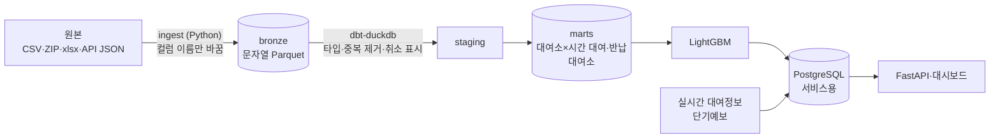

# bike-demand

서울시 공공자전거 따릉이의 과거 대여 기록과 날씨로 **대여소별 시간당 대여 수를 예측**하고, 실시간 대여정보와 합쳐 **곧 자전거가 부족해질 대여소**를 보여 주는 데이터 파이프라인과 예측 서비스.

> 개발 중. 1~4단계는 동작하고, API·대시보드(5단계)와 예보 날씨 영향 측정(6단계)이 남았다.

## 계획

| 단계 | 내용 | 상태 |
|---|---|---|
| 1. 과거 데이터 적재 | 대여이력(반기 공개, 2023-01~2026-06, 1억 4,464만 건) → 월별 Parquet → dbt로 정제 → 대여소별·시간별 대여·반납 수. 같은 달을 다시 넣어도 중복되지 않음 | 완료 |
| 2. 날씨 결합 | 기상청 ASOS 서울(108) 시간 관측값(기온, 강수, 풍속, 습도)을 시간 단위로 결합 | 완료 |
| 3. 실시간 수집 | 실시간 대여정보(대여소별 현재 자전거 수)를 10분마다, 단기예보를 발표마다 저장 (Airflow) | 동작 중 |
| 4. 예측 | LightGBM 하나로 전체 대여소의 시간별 대여 수 예측. 시간 순서로 나눠 검증(학습 2023~2024, validation 2025 상반기, test 2025 하반기~2026 상반기). test MAE 1.044, 대여소×요일구분×시간 평균 기준선 1.185 ([측정 기록](docs/experiments.md)) | 완료 |
| 5. 서비스 | 예상 대여 수 > 현재 자전거 수인 대여소를 FastAPI와 대시보드로 표시 | API 완료, 대시보드 예정 |
| 6. 추가 측정 | 학습은 관측 날씨, 실제 예측은 예보 날씨로 하게 되는 차이가 정확도를 얼마나 떨어뜨리는지 | 예정 |

## 구조



원본과 정제 단계는 파일(Parquet)과 DuckDB에서 처리하고, PostgreSQL에는 서비스에 필요한 것(대여소, 실시간 수집, 예측 결과)만 둔다. 1억 4천만 건 조회가 DuckDB에서 대부분 10초 안팎이라 원본 행을 DB에 올릴 이유가 없었다.

## 스택
Python 3.11 · uv · DuckDB · dbt · Airflow · PostgreSQL · LightGBM · FastAPI · Docker Compose

## 실행

```bash
uv sync
uv run python -m bike_demand.ingest.trips       # data/raw/trips → data/bronze/trips (약 8분)
uv run python -m bike_demand.ingest.stations    # data/raw/stations → data/bronze/stations
PYTHONUTF8=1 uv run dbt build --project-dir dbt --profiles-dir dbt
```

날씨 수집은 `.env.example`을 `.env`로 복사해 공공데이터포털 인증키를 넣은 뒤 `uv run python -m bike_demand.ingest.weather`.

테스트: `uv run pytest`, `uv run ruff check .` (DB 테스트는 `docker compose up -d db`가 떠 있어야 하고, 없으면 건너뜀)

### 서비스 DB와 Airflow

```bash
docker compose up -d db
uv run alembic upgrade head
uv run python -m bike_demand.serving.load stations
uv run python -m bike_demand.model.final serving        # 서비스용 모델 학습 (약 20분)
docker compose --profile airflow up -d --build          # Airflow 웹 화면 http://localhost:58080
```

| DAG | 일정 (KST) | 하는 일 |
|---|---|---|
| `collect_realtime` | 10분마다 | 따릉이 실시간 대여정보 → 원본 JSON·Parquet → `realtime_snapshots` |
| `forecast_and_predict` | 02·05·…·23시 15분 | 단기예보 → `weather_forecasts` → 앞으로 48시간 예측 `predictions` |
| `refresh_history` | 수동 | 새 반기 원본 변환 → ASOS → dbt build → 대여소 갱신 |

### API

```bash
uv run uvicorn bike_demand.api.main:app --port 8000   # http://localhost:8000/docs
```

| 요청 | 응답 |
|---|---|
| `GET /health` | DB 상태, 마지막 스냅샷 시각, 마지막 예측 시간 |
| `GET /stations?district=` | 대여소 목록 |
| `GET /stations/{station_id}` | 대여소 정보, 최근 스냅샷, 앞으로 6시간 예측 |
| `GET /shortage-risk?hours=3&limit=50&district=` | 앞으로 N시간 예상 대여가 지금 자전거 수보다 많은 대여소(부족 대수 순). 반납은 반영하지 않음 |
| `GET /predictions/{station_id}?date=YYYY-MM-DD` | 하루 시간별 예측 |

요청·응답 형식과 경계 규칙(어느 예측 버전을 쓰는지, 부분 시간 비례, 503과 빈 목록)은 [docs/api.md](docs/api.md).

### 대시보드

`uv run uvicorn bike_demand.api.main:app --host 127.0.0.1 --port 8000`으로 실행한 뒤
<http://127.0.0.1:8000/>에서 확인한다. 별도 빌드 없이 API와 같은 서버가 HTML·JS·CSS를 제공한다.
지도 도구(Leaflet CDN)와 OpenStreetMap 배경 타일을 불러오려면 인터넷 연결이 필요하다.

1~6시간과 자치구를 고르면 부족 예상 대여소를 지도와 표에 최대 500곳까지 표시한다.
대여소를 선택하면 현재 시간이 포함된 앞으로 6개 시간대의 예상 대여량을 볼 수 있다.
좌표가 없는 대여소도 표에 남으며, 반납 미반영·데이터 없음·예측 누락을 화면에 표시한다.
필터 변경 또는 새로고침 버튼으로 갱신하며, 마지막 수집 시각은 `/health`에서 가져온다.

DAG는 처음에 멈춘 상태로 만들어지므로 웹 화면이나 `docker compose exec airflow-scheduler airflow dags unpause <dag_id>`로 켠다. 프로젝트 패키지는 Airflow 이미지 안의 별도 가상환경(`/opt/bike/.venv`)에 설치되어 Airflow 의존성과 섞이지 않는다. 멈추려면 `docker compose --profile airflow stop`.

## 데이터 준비
원본 데이터는 용량이 커서 저장소에 넣지 않는다. 아래 파일을 받아 해당 폴더에 둔다.

| 폴더 | 파일 | 출처 |
|---|---|---|
| `data/raw/trips/` | `서울특별시 공공자전거 대여이력 정보_2023.zip`, `_2024.zip`, `_2025.zip`, `_2601.csv` ~ `_2606.csv` (약 9.0GB) | [서울 열린데이터광장 OA-15182](https://data.seoul.go.kr/dataList/OA-15182/F/1/datasetView.do) |
| `data/raw/stations/` | `공공자전거 대여소 정보(22.12월 기준).xlsx` ~ `(26.6월 기준).xlsx` 반기 파일 8개 | [서울 열린데이터광장 OA-13252](https://data.seoul.go.kr/dataList/OA-13252/F/1/datasetView.do) |

원본 형식과 품질 확인 결과(중복, 대여 취소로 본 기록, 해석할 때 주의점)는 [docs/data.md](docs/data.md).

## 데이터 출처
- 서울특별시 공공자전거 대여이력 정보, 대여소 정보, 실시간 대여정보: 서울 열린데이터광장 (공공누리 제1유형: 출처표시)
- 종관기상관측(ASOS) 자료, 단기예보: 기상청
