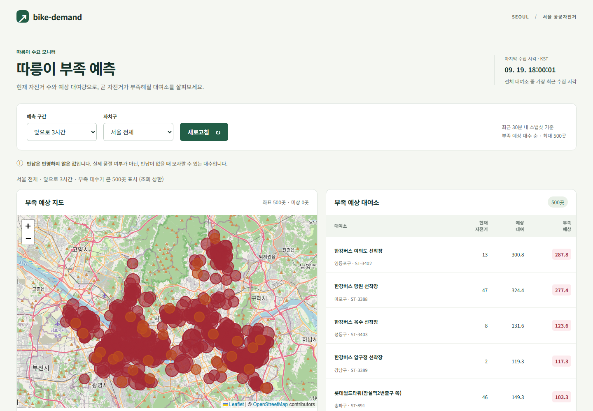
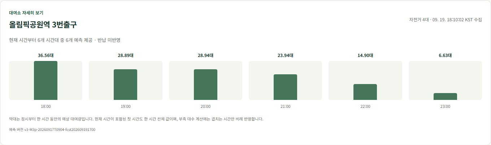
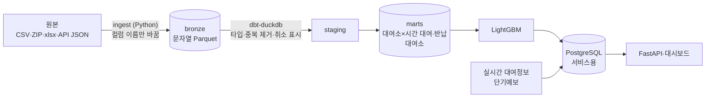

# bike-demand

서울시 공공자전거 따릉이의 과거 대여 기록과 날씨로 **대여소별 시간당 대여 수를 예측**하고, 실시간 대여정보와 합쳐 **곧 자전거가 부족해질 대여소**를 보여 주는 데이터 파이프라인과 예측 서비스.





화면은 2026-09-19 18시의 실제 수집 데이터다(지도: Leaflet, © OpenStreetMap contributors).

## 무엇을 했나

| 단계 | 내용 | 상태 |
|---|---|---|
| 1. 과거 데이터 적재 | 대여이력(반기 공개, 2023-01~2026-06, 1억 4,464만 건) → 월별 Parquet → dbt로 정제 → 대여소별·시간별 대여·반납 수. 같은 달을 다시 넣어도 중복되지 않음 | 완료 |
| 2. 날씨 결합 | 기상청 ASOS 서울(108) 시간 관측값(기온, 강수, 풍속, 습도, 신적설)을 시간 단위로 결합 | 완료 |
| 3. 실시간 수집 | 실시간 대여정보(대여소별 현재 자전거 수)를 10분마다, 단기예보를 발표마다 저장 (Airflow) | 동작 중 |
| 4. 예측 | LightGBM 하나로 전체 대여소의 시간별 대여 수 예측. 시간 순서로 나눠 검증 | 완료 |
| 5. 서비스 | 앞으로 N시간 예상 대여가 지금 자전거 수보다 많은 대여소를 FastAPI와 지도 대시보드로 표시 | 완료 |
| 6. 추가 측정 | 학습은 관측 날씨, 서비스는 예보 날씨를 쓰는 차이 | 계획·측정 코드 완료, 예보 1주일치가 쌓이고 관측이 공개되는 2026-09-26 이후 측정 |

## 결과

평가 지표는 대여소×시간 행의 대여 수 MAE(평균 절대 오차). 기준선 B0은 "학습 기간의 같은 대여소·요일구분·시간 평균"이다. 후보·지표·판정 규칙은 측정 전에 [docs/experiments.md](docs/experiments.md)에 적고 커밋했다.

| 측정 | 기간 | 결과 |
|---|---|---|
| v1 validation | 학습 2023~2024, 평가 2025 상반기 | M1(달력·날씨·대여소 패턴) 0.979, B0 1.210 → M1 |
| v1 test (한 번) | 2025 하반기~2026 상반기 | M1 1.044, B0 1.185. 다만 예측 평균이 실제보다 14% 높음 |
| v2 validation | v1과 같음 | M3(M1 + 그 시점에 공개돼 있던 최근 반기 수준) 0.932 → M3. 수준 편향 +14.7% → +6.2% |
| v2 test | v1과 같은 test 기간(**두 번째로 본 값**, 참고용) | M3 0.964, 편향 +0.3% |
| v3 validation | 검토에서 찾은 누수 두 가지와 날씨 정의를 고쳐 재측정 | M1' 0.978, M3' 0.927 → **M3'가 서비스 모델**. v1·v2와 거의 같음 |

- 가장 크게 기여한 특징은 학습 기간의 대여소×쉬는날여부×시간 평균(`profile_mean`, gain 74%)이고, 날씨는 기온 6%·강수 5% 정도다
- 서비스 모델은 M3'를 2023-01~2026-06 전체로 다시 학습한 것이다(조기 종료가 라운드 상한 2,000에 닿음)

## 설계 판단

- **정제는 DuckDB, Postgres는 서비스용만**: 1억 4천만 건 조회가 DuckDB에서 대부분 10초 안팎이라 원본 행을 DB에 올리지 않았다. dbt-duckdb가 Parquet 위에서 staging·marts를 만들고, Postgres에는 대여소·실시간 스냅샷·예보·예측만 둔다
- **예측할 때 알 수 있는 것만 특징으로**: 대여이력은 반기마다 공개돼 서비스 시점에 최근 대여 기록이 없다. 그래서 직전 몇 시간 대여 수 같은 lag 특징을 쓰지 않고, 수준 변화는 "그 행의 시각에 이미 공개돼 있었을 반기"로만 계산한다
- **측정 전에 계획을 커밋**: 후보·판정 규칙을 먼저 적고, validation으로 고르고, test는 한 번만 잰다. 규칙을 바꿀 일이 생기면 바꾼 이유와 시점을 남겼다
- **리뷰에서 찾은 누수는 다시 쟀다**: 과거 행에 최신 대여소 정보(거치대 수 등)가 붙던 것과, 조기 종료 구간의 대여가 특징 계산에 섞이던 것을 고쳐 v3로 재측정했다. 판정은 바뀌지 않았다
- **서비스 모델 교체가 읽는 쪽을 깨지 않게**: 학습 결과는 세대 폴더에 쓰고 `CURRENT` 포인터를 원자적으로 바꾼다. 예측 버전 이름은 세대 이름 + 예보 발표 시각이고, API는 한 응답에 한 버전만 쓴다
- **실시간 적재가 빠지지 않게**: 적재 날짜는 수집 시각으로 정하고, 날마다 적재에 성공한 원본 이름을 기록해 최근 7일 중 덜 적재된 날을 다음 실행이 회수한다. 실행마다 자기 Parquet 파일을 적재하므로 실행이 겹쳐도 기록이 적재를 앞서지 않는다
- **인증키가 새지 않게**: 공공 API 키는 URL에 들어가므로 요청 로그를 막고, 키가 반사된 응답(URL 인코딩·JSON 이스케이프 포함)은 저장하지 않는다

## 한계

- **반납을 반영하지 않는다**: 부족 대수는 "앞으로 N시간 예상 대여 − 지금 자전거 수"다. 실제로 자전거가 동나는지와 다르다
- **서비스 기간의 정확도를 모른다**: 2026-07 이후 대여이력은 반기 공개라 2027년 초에나 나온다. 예보 날씨를 쓰는 영향도 아직 재는 중이다(6단계)
- **예측 수준이 높을 수 있다**: 2026-09-17~23의 예측 평균은 2023·2024년 같은 시기(비 안 온 시간)의 실제와 거의 같고 2025년보다 15% 높다. 최근 반기 수준은 2025년과 비슷해서, 올가을이 작년 같다면 그만큼 높게 예측하는 셈이다. 확인은 대여이력이 공개된 뒤에야 할 수 있다([진단](docs/experiments.md), `scripts/check_prediction_level.py`)
- **날씨는 한 지점**: 서울 관측소 한 곳(108)과 예보 격자 한 곳(60·127)을 모든 대여소에 쓴다
- **test 기간을 두 번 봤다**: v2 test 값은 참고용이고, v3는 test를 다시 재지 않았다
- **공개 시점 가정**: 수준 특징은 반기가 끝나고 1개월 뒤 공개된다고 가정했다. 실제 공개는 더 늦을 수 있어 과거 행에서는 조금 유리하게 잰다
- **로컬 개발 구성**: Airflow는 로그인 없이 localhost에만 열려 있다. PC나 Docker가 꺼진 동안은 수집이 멈추고, 그 사이 스냅샷은 되살릴 수 없다

## 구조



## 스택
Python 3.11 · uv · DuckDB · dbt · Airflow · PostgreSQL · LightGBM · FastAPI · Docker Compose

## 실행

```bash
uv sync
uv run python -m bike_demand.ingest.trips       # data/raw/trips → data/bronze/trips (약 8분)
uv run python -m bike_demand.ingest.stations    # data/raw/stations → data/bronze/stations
PYTHONUTF8=1 uv run dbt build --project-dir dbt --profiles-dir dbt
```

날씨 수집은 `.env.example`을 `.env`로 복사해 공공데이터포털 인증키를 넣은 뒤 `uv run python -m bike_demand.ingest.weather`. 실시간 대여정보는 서울 열린데이터광장 인증키가 필요하다.

테스트: `uv run pytest`, `uv run ruff check .` (DB 테스트는 `docker compose up -d db`가 떠 있어야 하고, 없으면 건너뜀). 새로 클론한 저장소에서 `uv sync` → `ruff check`·`pytest`(207개)·`dbt parse`·`docker compose config`·`alembic history`가 원본 데이터 없이 통과하는 것을 확인했다(2026-09-17).

### 측정

```bash
uv run python -m bike_demand.model.validate      # v1 validation
uv run python -m bike_demand.model.validate_v2   # v2
uv run python -m bike_demand.model.validate_v3   # v3 (현재 서비스 모델 선택)
uv run python -m bike_demand.model.final serving # 고른 후보로 서비스 모델 학습 (M3', 이 PC에서 약 3시간)
```

test는 `model.final test`로 한 번만 잰다. 시작할 때 예약 파일을 만들어 겹친 실행과 재실행을 거부하고, v3 후보로는 test를 실행하지 않는다.

### 서비스 DB와 Airflow

```bash
docker compose up -d db
uv run alembic upgrade head
uv run python -m bike_demand.serving.load stations
docker compose --profile airflow up -d --build          # Airflow 웹 화면 http://127.0.0.1:58080
```

| DAG | 일정 (KST) | 하는 일 |
|---|---|---|
| `collect_realtime` | 10분마다 | 따릉이 실시간 대여정보 → 원본 JSON·Parquet → `realtime_snapshots` (덜 적재된 최근 7일 회수) |
| `forecast_and_predict` | 02·05·…·23시 15분 | 단기예보 → `weather_forecasts` → 앞으로 48시간 예측 `predictions` |
| `refresh_history` | 수동 | 새 반기 원본 변환 → ASOS → dbt build → 대여소 갱신 |

`refresh_history`로 새 반기 자료를 넣은 뒤에는 `model.final serving`으로 서비스 모델과 학습 산출물(대여소 패턴, 반기 수준)을 다시 만든다. 다시 만들지 않은 채 다음 반기의 공개 시점을 넘기면 최근 수준 특징은 결측으로 들어간다.

DAG는 처음에 멈춘 상태로 만들어지므로 웹 화면이나 `docker compose exec airflow-scheduler airflow dags unpause <dag_id>`로 켠다. 프로젝트 패키지는 Airflow 이미지 안의 별도 가상환경(`/opt/bike/.venv`)에 설치되어 Airflow 의존성과 섞이지 않는다. 컨테이너는 Docker가 다시 시작되면 같이 올라온다. 멈추려면 `docker compose --profile airflow stop`.

### API

```bash
uv run uvicorn bike_demand.api.main:app --host 127.0.0.1 --port 8000   # http://127.0.0.1:8000/docs
```

| 요청 | 응답 |
|---|---|
| `GET /health` | DB 상태, 마지막 스냅샷 시각, 마지막 예측 시간 |
| `GET /stations?district=` | 대여소 목록 |
| `GET /stations/{station_id}` | 대여소 정보, 최근 스냅샷, 앞으로 6시간 예측 |
| `GET /shortage-risk?hours=3&limit=50&district=` | 앞으로 N시간 예상 대여가 지금 자전거 수보다 많은 대여소(부족 대수 순). 반납은 반영하지 않음 |
| `GET /predictions/{station_id}?date=YYYY-MM-DD` | 하루 시간별 예측 |

요청·응답 형식과 경계 규칙(어느 예측 버전을 쓰는지, 부분 시간 비례, 503과 빈 목록)은 [docs/api.md](docs/api.md), 테이블은 [docs/serving-schema.md](docs/serving-schema.md).

### 대시보드

API를 띄운 뒤 <http://127.0.0.1:8000/>에서 확인한다. 별도 빌드 없이 API와 같은 서버가 HTML·JS·CSS를 제공한다. 지도 도구(Leaflet CDN)와 OpenStreetMap 배경 타일을 불러오려면 인터넷 연결이 필요하다.

1~6시간과 자치구를 고르면 부족 예상 대여소를 지도와 표에 최대 500곳까지 표시한다. 대여소를 선택하면 현재 시간이 포함된 앞으로 6개 시간대의 예상 대여량을 볼 수 있다. 좌표가 없는 대여소도 표에 남으며, 반납 미반영·데이터 없음·예측 누락을 화면에 표시한다. 필터 변경 또는 새로고침 버튼으로 갱신하며, 마지막 수집 시각은 `/health`에서 가져온다.

## 데이터 준비
원본 데이터는 용량이 커서 저장소에 넣지 않는다. 아래 파일을 받아 해당 폴더에 둔다.

| 폴더 | 파일 | 출처 |
|---|---|---|
| `data/raw/trips/` | `서울특별시 공공자전거 대여이력 정보_2023.zip`, `_2024.zip`, `_2025.zip`, `_2601.csv` ~ `_2606.csv` (약 9.0GB) | [서울 열린데이터광장 OA-15182](https://data.seoul.go.kr/dataList/OA-15182/F/1/datasetView.do) |
| `data/raw/stations/` | `공공자전거 대여소 정보(22.12월 기준).xlsx` ~ `(26.6월 기준).xlsx` 반기 파일 8개 | [서울 열린데이터광장 OA-13252](https://data.seoul.go.kr/dataList/OA-13252/F/1/datasetView.do) |

원본 형식과 품질 확인 결과(중복, 대여 취소로 본 기록, 해석할 때 주의점)는 [docs/data.md](docs/data.md).

## 데이터 출처
- 서울특별시 공공자전거 대여이력 정보, 대여소 정보, 실시간 대여정보: 서울 열린데이터광장 (공공누리 제1유형: 출처표시)
- 종관기상관측(ASOS) 자료, 단기예보: 기상청
